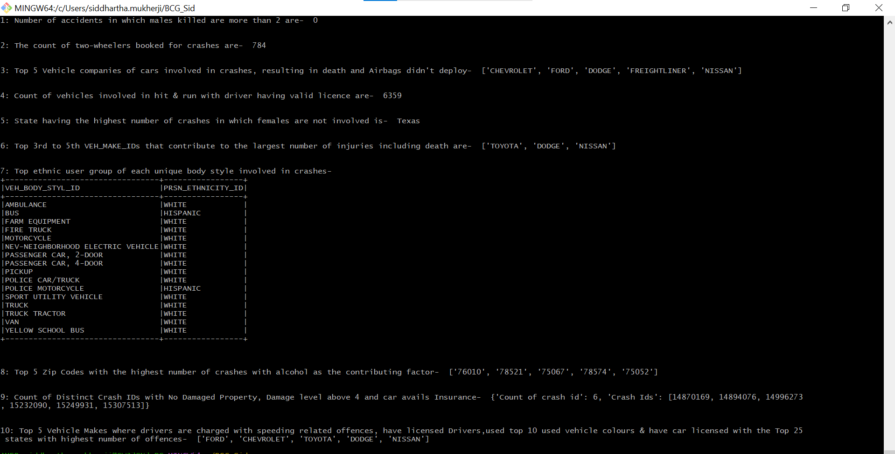

# BCG US Vehicle Accident Analysis using PySpark

## Overview

This project analyzes US vehicle accident data to answer various questions about crash demographics, vehicle types, contributing factors, and more. It utilizes PySpark's DataFrame API for efficient data processing and transformation.

## Dataset

The dataset consists of 6 CSV files located in the "Data" folder:

- `Charges_use.csv`
- `Damages_use.csv`
- `Endorse_use.csv`
- `Primary_Person_use.csv`
- `Restrict_use.csv`
- `Units_use.csv`

Refer to the [Data_Dictionary.xlsx](Data_Dict/Data_Dictionary.xlsx) file in the `Data_Dict` folder for detailed information about each file and its columns.

## Analytics

The application performs the following analyses and stores the results in separate output files:

1. Count the number of crashes where males were killed.
2. Count the number of crashes involving two-wheelers.
3. Identify the top 5 vehicle makes involved in fatal crashes where airbags did not deploy.
4. Count the number of vehicles with validly licensed drivers involved in hit-and-run accidents.
5. Determine the state with the highest number of accidents where females are not involved.
6. Find the 3rd to 5th most common vehicle makes contributing to the largest number of injuries (including deaths).
7. For each unique body style involved in crashes, identify the top ethnic user group.
8. Find the top 5 zip codes with the highest number of crashes where alcohol was a contributing factor.
9. Count the number of distinct crash IDs where no property damage was observed, the damage level is above 4, and the car has insurance.
10. Determine the top 5 vehicle makes where drivers are charged with speeding-related offenses, have licensed drivers, used one of the top 10 used vehicle colors, and have cars licensed in one of the top 25 states with the highest number of offenses.

## Project Structure

The project is organized into modules and follows software engineering best practices:

- **Input data sources and output paths** are configured in `config.py`.
- The code exclusively uses **PySpark's DataFrame API** (no Spark SQL).

- This project has been tested on Windows using Git Bash, which provides a Unix-like environment. If you are using a MinGW terminal, you may need to modify the make commands to `mingw32-make` or the appropriate format. Since this is tested on Windows some steps regarding JDK and Hadoop might not be applicable or 
could be different, but these steps are vigirously tested in Windows env. 

-  The project has also been tested on macOS. If you are using a Linux-based operating system like macOS or other Linux distributions, steps 4, 5 and 6 may not be required. You can proceed directly to step 7, just ensure that Apache Spark is installed so you can run spark-submit. You can check the Spark version using `spark-submit --version` and install it using `brew install apache-spark` (on macOS) or the appropriate package manager for your Linux distribution.


## Setup and Execution

### Prerequisites

- Python 3.x
- Spark
- Git Bash (with `make`)
- Java Development Kit (JDK)
- Hadoop

### Steps

1. **Clone the repository:**

   ```bash
   git clone <repository_url>
   ```

2. **Navigate to the project directory:**

   ```bash
   cd <project_directory>
   ```
   
3. **Open Terminal or Command Prompt:**

   - **Windows:** You can use Git Bash, Command Prompt, or Windows Terminal.
   - **macOS and Linux:** Use the built-in Terminal application.
   - **IDEs:** If you are using an IDE like PyCharm or Visual Studio Code, you can open the terminal directly within the IDE.

   **Important:** Before starting step 4, you may try skipping directly to step 7 and running the project. If you encounter issues, come back to steps 4-6 for troubleshooting. It is possible that you may not require some or any of these steps, especially if you are on a Linux-based system or macOS.


4. **Set `JAVA_HOME`:**

   - Open your `.bashrc` file:

     ```bash
     nano ~/.bashrc
     ```

   - Add the following line, replacing `<your_jdk_path>` with the actual path to your JDK installation:

     ```bash
     export JAVA_HOME="/c/Program Files/Java/<your_jdk_path>"
     ```

   - Save the file and source it:

     ```bash
     source ~/.bashrc
     ```

5. **Set `HADOOP_HOME`:**

   - Similarly, add the following line to your `.bashrc` file, replacing `<your_hadoop_path>` with the path where you extracted Hadoop:

     ```bash
     export HADOOP_HOME="/c/<your_hadoop_path>"
     ```

   - Save the file and source it again.

6. **Place `winutils.exe` in `C:\Hadoop\bin`:**

   - Download `winutils.exe` (compatible with your Hadoop version) and place it in `C:\Hadoop\bin`.
   - If the `bin` directory doesn’t exist, create it first.

7. **Prepare the data:**

   ```bash
   make prep_to_run
   ```

8. **Build the project:**

   ```bash
   make build
   ```

9. **Install the package:**

   ```bash
   make install
   ```

10. **Run the application:**

    ```bash
    make run
    ```

### Additional Notes

- See `make help` for a list of available commands.
- Use `make clean` to remove generated files.

**Alternative Installation Methods**

If you prefer not to use the make commands or encounter any issues, you can install the required packages (PySpark, JDK, Hadoop) manually. Please refer to the  official documentation for each package for detailed installation instructions specific to your operating system.

## Test Results

Below is an image showing the test results :


